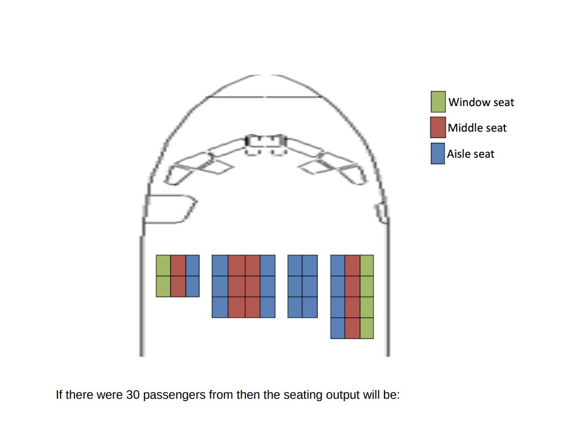
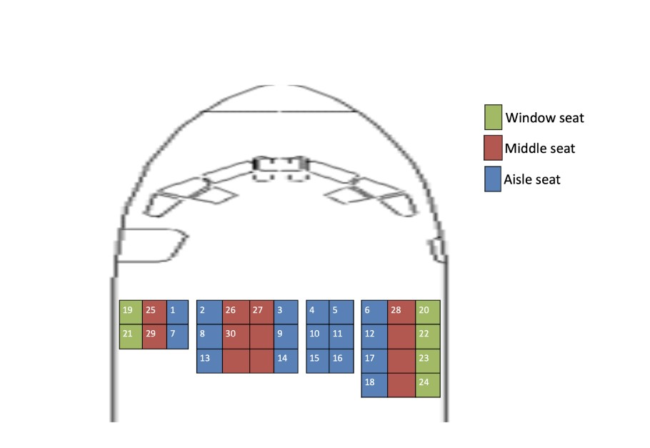
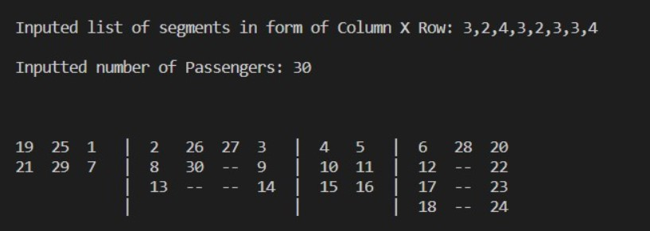
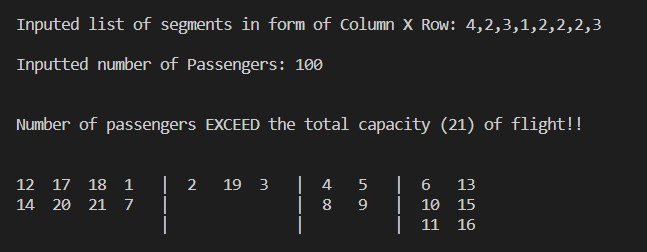
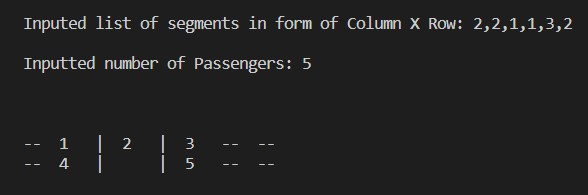
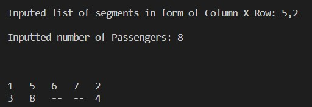

# About Myself
Hi! My name is Gaurav Gupta, 3rd year studen, currently pursuing B.Tech in Computer Science from Jaypee Institute of Information Technology, Sector 62, Noida. 

## Question
##### Airplane Seating Algorithm
Write a program that helps seat audiences in a flight based on the following input and
rules.
#### Rules for seating
1. Always seat passengers starting from the front row to back, starting from the left to
the right
2. Fill aisle seats first followed by window seats followed by center seats (any order in
center seats)
#### Input to the program will be
1. A 2D array that represents the columns and rows - Ex. [[3,4], [4,5], [2,3], [3,4]]
2. Number of passengers waiting in the queue.

#### Example
**Given** - A 2D array that represents the columns and rows - [[3,2], [4,3], [2,3], [3,4]]

##### Input

##### Output

## Solution Approach
1) Firstly, **calculate number of window,aisle and total seats**. With the help of these 3, **number of middle seats is calculated**..
2) Then we know that starting number for aisle seat would be 1 i.e. `ais_start=1`
Similiarly, `wind_start=number of aisle seats+1` and `mid_start=number of aisle + number of window seats + 1`.
3) Then **2D array is created for displaying output** whose number of **rows is equal to maximum number of rows entered by the user and number of columns is sum of all the columns entered by the user**.
4) **One column list is also made which stores the number of columns of each segment** of seats entered by user.
5) **start pointer is used to find the column numbe**r with reference to that particular section & segment pointer is used to point the segment in which we are present.
6) For example, if `start_ptr=3 and seg_ptr=1` and `j(loop iterator) is 5` **then we are at 2nd column of segment 1** as `j-start_ptr=2 and seg_ptr==1`
7) If `j-start_ptr==column_list[seg_ptr]` then it means that **we have crossed the column limit of the particular segment** hence we proceeded to next segment. Therefore, **we will increase seg_ptr by 1** and will set `start_ptr = j`
8) To check if the seat is available for the passenger in the segment **we just need to check that if number of rows in the particular segment > present row number of the seat. If yes, then seat is available else not.**
9) We can fill the passenger according to the segment and column number. For example, `if seg_ptr == 0 and j-start_ptr==0 and wind_start<=passengers` then `output[row,column]=wind_start` and `wind_start=wind_start+1` as **column 0 of segment 0 will always be a window seat.**
8) Similiarly, we can fill the rest of the segments using the similiar logic.

## Test Cases
##### NOTE
- **'--' is used to represent empty seats available**
- **Vertical Lines ( | ) is used to differentiate between seat segments**

## Time Complexity
The Time Complexity of proposed solution is **O(nm)** where `n = maximum number of rows and m = sum of all the columns`

## Language Used
- Python latest version

## Libraries Used
**You can install library entring `pip install numpy` in your command shell.**
- Numpy

## Software Required

- Visual Studio Code
- Python IDE

## Input Variables 

| Variable Name | Description |
| ------ | ------ |
| list_ | To store seat segments in column X row format |
| passengers |  To store the numbers of passengers waiting in the queue  |

## Output Variables

| Variable Name | Data Type | Description |
| ------ | ------ | ------ |
| output | list (int) | Single 2D array which stores either passenger number,0 if seat is avaialable or or -1 if seat is not available  |

## RUN

- Set the directory where the file is stored using `cd` command.
- Run the file by entering `python code.py` in IDE command shell.
